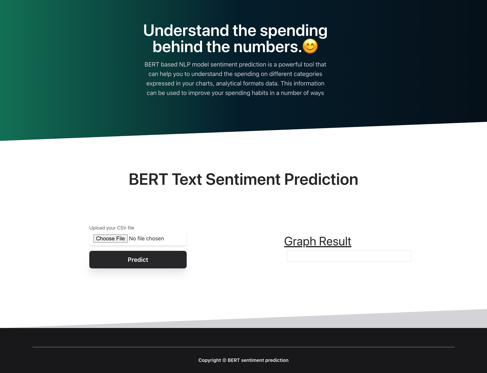
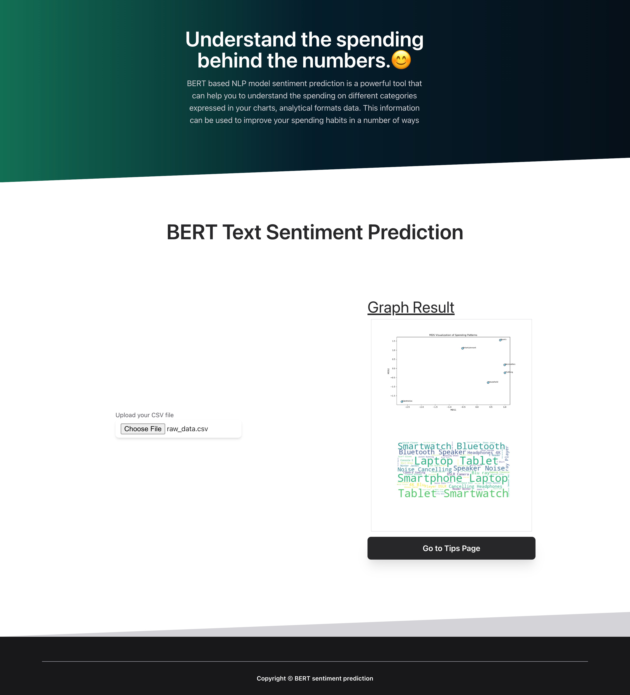
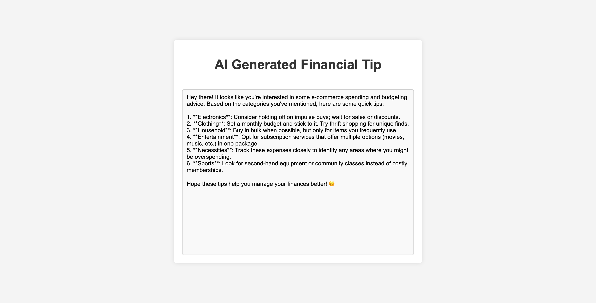
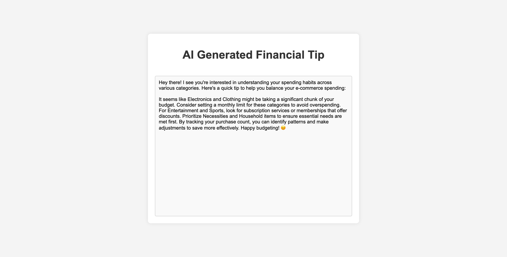

# BetterFinancialTips
generating budgeting advice and financial spending tips using NLP and ML - ECMM6000 Term Project

## How to run the code
1. Clone the repository or extract the submitted zip file to a desired location
2. Install the required packages using the following command
- pip install -r requirements.txt
3. Replace the placeholder API key in line 10 of `app.py` file with the key provided in the report
- We have provided the API key for testing in our report submission for the project. 
4. Run the following command to start the application
- python app.py
5. Open the browser and go to the following URL
- http://127.0.0.1:5000
6. Select the csv file containing the financial data from 'BetterFinancialTips/uploads/raw_data.csv' and click on the predict button
7. Give the application a couple of minutes to process the data and display the results
8. Once the graphs are displayed, you can click the 'go to the tips page' button to get the financial tips generated by the AI model
9. This will take you to a new page where you can see the generated tips, there is no return... (unless you hit back)

## Incase of any issues, here are some images of the application
1. Home Page

2. Initial Graph predictions

3. Generated Tip Sample 1

4. Generated Tip Sample 2

