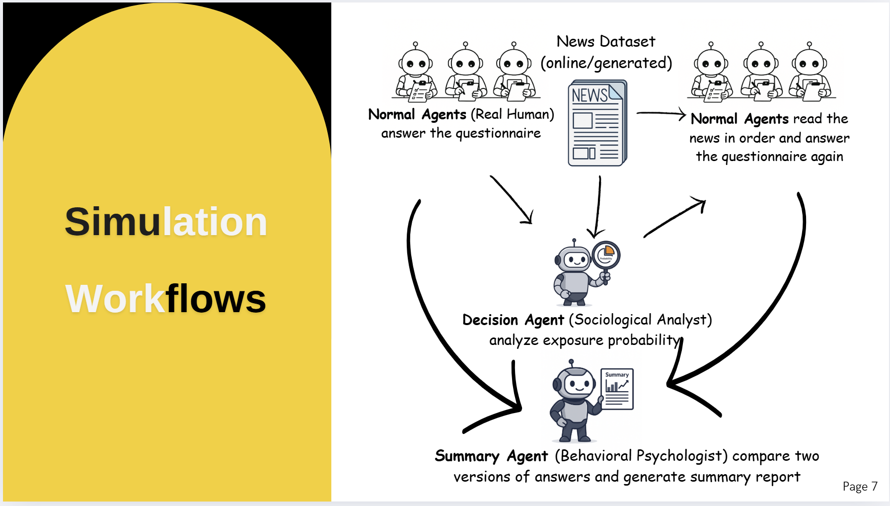
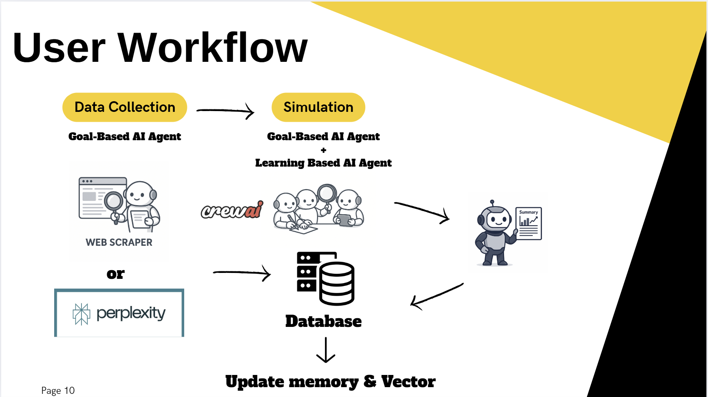

# Atlantic AI Summit 2025 Health Data Competition
# Vaccine Hesitancy Simulation Lab

A web-based simulation dashboard for modeling how individuals respond to vaccine-related news based on their demographic profiles and personality traits.

> Team Members
  - Yuhan Fu
  - Kya Masoumi Ravandi
  - Pavankumar Sakhare

## Introduction

The Vaccine Hesitancy Simulation Lab is an educational tool designed to simulate how different individuals (agents) respond to various types of news about vaccines. The simulation takes into account demographic factors such as age, gender, income, and education level, as well as personality traits, to model how attitudes toward vaccination might change when exposed to different news items.

This tool can be used by:
- Public health researchers
- Communication strategists
- Educators
- Students learning about health communication
- Anyone interested in understanding the dynamics of information spread and attitude formation

## Features

- **Agent Management**: Create, edit, and delete agent profiles with demographic information and personality traits
- **News Management**: Create, edit, and delete news items with different truthfulness levels and sentiment types
- **Drag-and-Drop Interface**: Reorder news items to simulate different exposure sequences
- **AI-Generated Profiles**: Generate realistic agent profiles based on age and gender
- **Interactive Simulation**: Run simulations to see how agents' attitudes change in response to news exposure
- **Visual Results**: View simulation results with a line chart showing attitude changes
- **Simulation Summary**: Get an overview of how the news exposure affected the agent population

## Technical Stack

- **Backend**: Python Flask
- **Frontend**: HTML, CSS, JavaScript
- **Styling**: Bootstrap 5
- **Charts**: Chart.js
- **Drag-and-Drop**: SortableJS

## Installation

### Prerequisites

- Python 3.7 or higher
- pip (Python package installer)

### Setup

1. Clone the repository:
   \`\`\`
   git clone https://github.com/yourusername/vaccine-hesitancy-simulation.git
   cd vaccine-hesitancy-simulation
   \`\`\`

2. Create a virtual environment (optional but recommended):
   \`\`\`
   python -m venv venv
   \`\`\`

3. Activate the virtual environment:
   - On Windows:
     \`\`\`
     venv\Scripts\activate
     \`\`\`
   - On macOS/Linux:
     \`\`\`
     source venv/bin/activate
     \`\`\`

4. Install the required dependencies:
   \`\`\`
   pip install -r requirements.txt
   \`\`\`

## How to Run the Application

1. Make sure you're in the project directory with the virtual environment activated.

2. Start the Flask application:
   \`\`\`
   python app.py
   \`\`\`

3. Open your web browser and navigate to:
   \`\`\`
   http://127.0.0.1:5000/
   \`\`\`

4. The application should now be running and accessible through your browser.

## Project Structure

\`\`\`
vaccine-hesitancy-simulation/
├── app.py                  # Main Flask application
├── requirements.txt        # Python dependencies
├── README.md               # This file
├── static/                 # Static files
│   ├── css/                # CSS stylesheets
│   │   └── styles.css      # Main stylesheet
│   └── js/                 # JavaScript files
│       └── main.js         # Main JavaScript file
└── templates/              # HTML templates
    └── index.html          # Main application template
\`\`\`

## Usage Guide

### Creating Agents

1. Click the "+ Add Agent" button in the Agents panel.
2. Fill in the required fields (Age, Gender, Current Vaccine Attitude).
3. Optionally, fill in additional fields (Income Level, Education, Personality Traits).
4. Alternatively, click "Generate with AI" to automatically generate a profile based on the provided age and gender.
5. Click "Save" to add the agent.

### Creating News Items

1. Click the "+ Add News" button in the News panel.
2. Fill in the required fields (News Title, Truthfulness, Sentiment).
3. Optionally, add content and source information.
4. Click "Save" to add the news item.

### Reordering News

- Drag and drop news items in the News panel to change the order in which agents will be exposed to them.

### Running a Simulation

1. Make sure you have at least one agent created.
2. Click the "Simulate" button in the Analysis panel.
3. View the simulation results, including:
   - A summary of how attitudes changed
   - A line chart showing before and after attitudes for each agent

### Editing and Deleting

- Click on an agent card to edit that agent's information.
- Click on the trash icon on an agent card to delete that agent.
- Click on the ellipsis icon on a news card to edit that news item.
- Click on the trash icon on a news card to delete that news item.
- Click on a news card (not on the icons) to view its full content.

## Contributing

Contributions are welcome! Please feel free to submit a Pull Request.

1. Fork the repository
2. Create your feature branch (`git checkout -b feature/amazing-feature`)
3. Commit your changes (`git commit -m 'Add some amazing feature'`)
4. Push to the branch (`git push origin feature/amazing-feature`)
5. Open a Pull Request

## Demo Application Images 
1. Home Page

2. Report generated with AI Agent Workflow

3. Top level AI Agent Simulation (Decision Maker - Information collector)

4. Application Internal Workflow

## License

This project is licensed under the MIT License - see the LICENSE file for details.

## Acknowledgements

- [Flask](https://flask.palletsprojects.com/)
- [Bootstrap](https://getbootstrap.com/)
- [Chart.js](https://www.chartjs.org/)
- [SortableJS](https://sortablejs.github.io/Sortable/)
